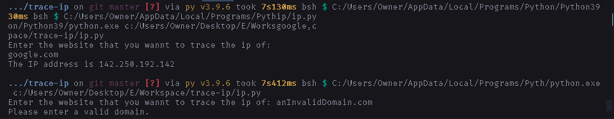

# How to use

1. Install [python](https://python.org/downloads).
2. Download [`ip.py`](https://raw.githubusercontent.com/DhruvMitna/trace-ip/master/ip.py).
3. Open your downloads folder and open `ip.py`.

### An example

